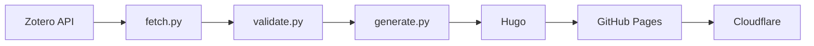

# Archive

Static archive of scientific publications and teaching materials — [korikov.cc](https://korikov.cc).
Content is generated from a Zotero library; the repository holds only the pipeline, theme, and config.

## Pipeline



- **fetch** — pull items from the Zotero API into `site/static/data/publications.json`
- **validate** — check the data against the Pydantic schema + editorial rules
- **generate** — render Hugo content (`site/content/`) from `publications.json` + `archive.yaml`
- **Hugo** — build the static site into `public/`

Source of truth is `archive.yaml` (about, contacts, groups, sections) + the Zotero library. Generated content under `site/content/` is **not** committed.

## CI

Two GitHub Actions workflows:

- **`deploy.yml`** — on push to `master`, manual dispatch, or a Zotero change. Runs `make lint`, then `make fetch && make deploy` (validate → generate → Hugo), and publishes to Pages.
- **`check.yml`** — daily cron (09:00 UTC). Hashes the Zotero library via `check_zotero.py`; on a changed hash it triggers `deploy.yml`. Keeps the site in sync without committing data.

Unit tests (`make test`, pytest) run locally — the visual/smoke suite needs a live `hugo server`, so it is not part of CI.

## Commands

```sh
make serve     # local dev server with auto-rebuild
make lint      # ruff + yamllint + djlint
make test      # pytest (requires a running hugo server)
make fetch     # refresh publications.json from Zotero
make deploy    # clean build into public/
```

## Credentials

Get an API key at <https://www.zotero.org/settings/keys>. The library ID is the numeric part of your Zotero profile URL.

- **Development:** `.env` in the project root (gitignored):

  ```
  ZOTERO_API_KEY=<your_api_key>
  ZOTERO_LIBRARY_ID=<your_library_id>
  ```

- **Production:** `ZOTERO_API_KEY` and `ZOTERO_LIBRARY_ID` repository secrets (Settings → Secrets and variables → Actions).
